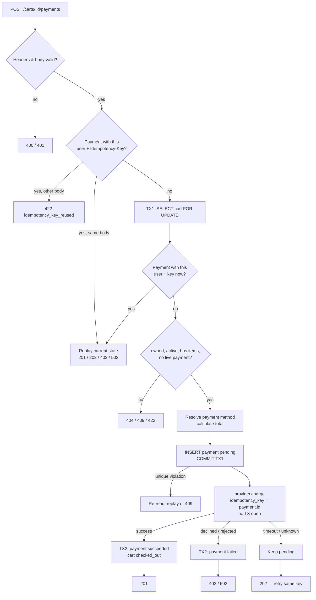
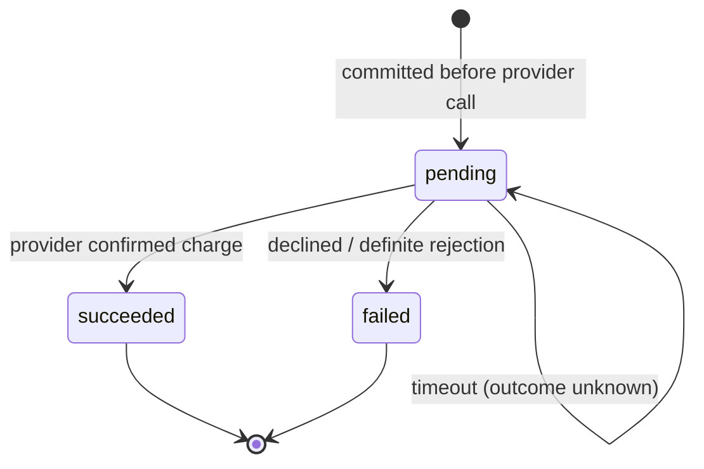
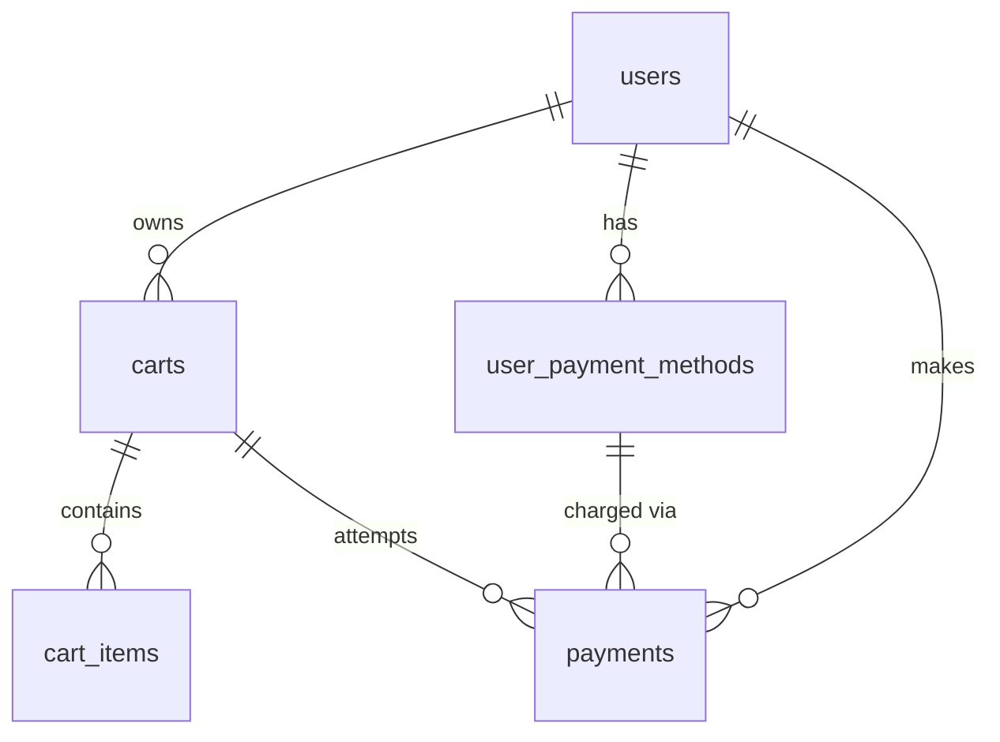

# Tech Spec — Cart Payment Endpoint

| | |
|---|---|
| **Author** | Andrii S |
| **Date** | 2026-09-29 |
| **Status** | Draft (rev. 2 — after adversarial review) |
| **Stack** | Python, Flask, SQLAlchemy, PostgreSQL 13+, pytest |

---

## 1. Context

An online shop sells physical products. A user fills a cart and pays for it with a saved credit card. Users, products, carts, cart items and saved payment methods (provider tokens) already exist in the base schema. The payment total is computed by an existing service.

We must deliver:

1. A **SQL schema** (new migration) for payments.
2. An **HTTP endpoint** that starts the payment for a cart.
3. A **mock payment provider**, **tests**, and a **README** with run instructions and assumptions.

A payment endpoint must hold three guarantees. This whole spec is built around them:

| Guarantee | Threat | Mechanism |
|---|---|---|
| **Never charge twice** | Retries, double clicks, parallel requests, timeouts | Client idempotency key, provider idempotency key, one live payment per cart (DB index) |
| **Never lose a charge** | Crash or timeout after the provider charged the card | The payment row is written *before* the provider call; an unknown outcome stays `pending`, never `failed` |
| **Charge exactly what was validated** | Cart changes during the payment | Amount snapshot, cart guard while a payment is live |

---

## 2. Assumptions

| # | Assumption | Reason |
|---|---|---|
| A-1 | The caller's identity comes from an `X-User-Id` header, set by a trusted gateway. | No auth system exists. The header is spoofable, so it is only safe behind a gateway. |
| A-2 | The endpoint calls the provider **synchronously**. If the outcome is unknown (timeout), the response is `202` and the client polls by repeating the request with the same idempotency key. | The mock needs no webhooks, and the same design still works with a real provider. |
| A-3 | The total-calculation service is an injected interface. The default implementation is `sum(quantity * unit_price)` over the cart items. It runs **inside TX1**, on the same session, while the cart is locked, so the amount matches the locked items. It MUST be in-process DB work. A remote total service would be network I/O under a row lock (NFR-3) and would need a different design. | The task says this service exists. |
| A-4 | A cart has one currency. A cart with mixed currencies is rejected. | The base schema stores currency per product only. |
| A-5 | When the request has no `payment_method_id`, the user's default method is used. If there are several defaults, the most recently created one wins. | The base schema does not enforce a single default. |
| A-6 | Stock is not checked or decremented. | That is order fulfilment (see Out of Scope). |
| A-7 | The mock provider's result depends on the token (see Mock payment provider). | Tests need deterministic results. |

---

## 3. Functional Requirements

| ID | Requirement |
|---|---|
| FR-1 | The system MUST expose `POST /carts/{cart_id}/payments` to charge the cart. |
| FR-2 | The request MUST include an `Idempotency-Key` header (1–255 printable ASCII chars). The key is scoped per user. |
| FR-3 | A repeat request with the same key and the same request body MUST return the **current** state of the original payment, with the status code for that state, and MUST NOT call the provider again. |
| FR-4 | A repeat request with the same key but a **different** request (cart or payment method) MUST be rejected with `422 idempotency_key_reused`. The comparison uses the request **as sent**, not the resolved payment method, so a retry stays a replay even if the user's default card changed in between. |
| FR-5 | The cart MUST exist and belong to the caller. Otherwise → `404`. |
| FR-6 | The cart MUST be `active`, MUST have at least one item, and MUST NOT already have a live (`pending`/`succeeded`) payment. |
| FR-7 | The payment method MUST belong to the caller (see A-5 for the default). |
| FR-8 | The amount MUST come from the total service and MUST be > 0. The client MUST NOT send the amount. The amount and currency are saved on the payment as a snapshot. |
| FR-9 | A `payments` row with status `pending` MUST be committed **before** the provider is called. |
| FR-10 | The provider MUST be called with `idempotency_key = payment.id`, so a provider-side retry of the same attempt never charges twice. |
| FR-11 | **Success:** payment → `succeeded`, save `provider_payment_id`, cart → `checked_out`, in **one transaction**. |
| FR-12 | **Decline or definite provider rejection:** payment → `failed` with `failure_code`. The cart stays `active`, and the user may retry with a new key. |
| FR-13 | **Unknown outcome (timeout, lost connection):** the payment MUST stay `pending`, the response is `202`, and the cart stays blocked until the payment is reconciled. The payment MUST NOT be marked `failed`. |
| FR-14 | Status changes MUST be guarded: `UPDATE … WHERE id = :id AND status = 'pending'`. Terminal states never change. |
| FR-15 | While a cart has a live payment, cart changes (add or remove items, abandon) MUST be rejected. This is a contract that the cart service must follow. |
| FR-16 | A payment keeps its references to the cart, the user and the payment method forever. A saved card that has been used by a payment MUST NOT be hard-deleted; the owner of `user_payment_methods` must soft-delete it instead. The foreign keys enforce this (the `DELETE` fails). This is a contract for the service that owns saved cards. |

## 4. Non-Functional Requirements

| ID | Requirement |
|---|---|
| NFR-1 | **Money:** use `NUMERIC(12,2)` / `Decimal` only, never `float`. JSON returns amounts as strings (`"70.00"`). The provider gets integer minor units (`7000`). |
| NFR-2 | **Concurrency:** N parallel requests for one cart MUST produce at most one provider charge (a cart row lock plus a partial unique index). |
| NFR-3 | **No locks across I/O:** no DB transaction or row lock is held during the provider call. |
| NFR-4 | **Security:** `provider_token` MUST NOT appear in responses, logs or error messages. Only `last_four` may be shown. Raw provider error text is not stored; it is mapped to a fixed `failure_code`. |
| NFR-5 | **Access control:** every lookup filters by `user_id`. Another user's carts and payment methods return `404`, never `403`, so their existence is not revealed. |
| NFR-6 | **Timeouts:** the provider call has an explicit timeout (config, default 10 s). |
| NFR-7 | **Observability:** every log line for a payment carries `payment_id`, `cart_id` and `user_id`. |
| NFR-8 | **Testability:** the provider, the total service and the clock are injected via `create_app()`. Tests run against a real PostgreSQL, because partial indexes and `FOR UPDATE` cannot be tested on SQLite. |

---

## 5. Payment Flow



### Payment status lifecycle



- `pending` means **"money may be moving"**. It blocks the cart and is never assumed to have failed.
- `failed` means the provider **confirmed** there was no charge. Only then may the user retry with a new key.
- A `pending` payment is resolved by reconciliation. In production that is a provider lookup by `payment.id`. For this task it is out of scope; see OS-5.

---

## 6. API Contract

### Request

```
POST /carts/{cart_id}/payments
X-User-Id: <uuid>                 (required)
Idempotency-Key: <1–255 ASCII>    (required)
Content-Type: application/json
```

```ts
interface CreatePaymentRequest {
  payment_method_id?: string; // uuid; the user's default method when missing
}
```

An empty body, `{}` and `"payment_method_id": null` all mean "use the default method". Any other field (for example `amount`, see FR-8), a body that is not a JSON object, or malformed JSON is `400 invalid_request`. Validation order: `X-User-Id` (401, including a well-formed but unknown user), then the body size (411 for a chunked body without a length, 413 over 16 KB), then `Idempotency-Key` and body (400), then the cart and business rules. Chunked bodies are rejected because, depending on the WSGI server, they can be cut or dropped, and a dropped body would mean "use the default card".

### Response

```ts
interface Payment {
  id: string;                  // uuid
  cart_id: string;
  payment_method_id: string;
  amount: string;              // decimal string, "70.00"
  currency: string;            // ISO 4217
  status: "pending" | "succeeded" | "failed";
  provider_payment_id: string | null;
  failure_code: "card_declined" | "provider_error" | null;
  created_at: string;          // ISO 8601
  updated_at: string;
}

interface ErrorResponse {
  error: {
    code: string;
    message: string;
    payment_id?: string; // only for payment_in_progress: the live payment blocking the cart
  };
}
```

`payment_id` in a `payment_in_progress` error lets any client of the same user (for example another device, which does not have the original key) see which payment blocks the cart. It never refers to another user's payment, because the cart lookup is already scoped by `user_id` (NFR-5).

A replayed response has the header `Idempotent-Replayed: true`.

### Status codes

| HTTP | Body | When |
|---|---|---|
| 201 | `Payment` succeeded | Card charged |
| 202 | `Payment` pending | Outcome unknown. Retry with the same key to get the result |
| 400 | `missing_idempotency_key`, `invalid_request` | Missing header, bad UUID, bad body |
| 401 | `unauthenticated` | `X-User-Id` missing or unknown |
| 402 | `Payment` failed, `card_declined` | Provider declined |
| 404 | `cart_not_found`, `payment_method_not_found` | Missing, or owned by another user |
| 409 | `cart_not_active`, `payment_in_progress` | Cart checked out or abandoned; a live payment exists under another key |
| 422 | `cart_empty`, `no_payment_method`, `mixed_currencies`, `invalid_amount`, `idempotency_key_reused` | Business rule violated |
| 502 | `Payment` failed, `provider_error` | Provider definitely rejected the request (no charge) |

A replay returns the status code that matches the payment's **current** state. For example, a `202` becomes `201` once the payment is reconciled.

Errors outside the payment rules use the same `ErrorResponse` shape. Their `code` is the HTTP status name in snake case: `not_found` (404, unknown route), `method_not_allowed` (405, with an `Allow` header), `length_required` (411), `request_entity_too_large` (413). Any other framework error follows the same rule. An unexpected error is `internal_error` (500) and never includes internal details.

---

## 7. Data Model

### 7.1 `payments` table (new migration)

```sql
CREATE TABLE payments (
    id                  UUID           PRIMARY KEY DEFAULT gen_random_uuid(),
    cart_id             UUID           NOT NULL REFERENCES carts(id),
    user_id             UUID           NOT NULL REFERENCES users(id),
    payment_method_id   UUID           NOT NULL REFERENCES user_payment_methods(id),
    amount              NUMERIC(12, 2) NOT NULL CHECK (amount > 0),
    currency            CHAR(3)        NOT NULL,
    status              TEXT           NOT NULL DEFAULT 'pending'
                                       CHECK (status IN ('pending', 'succeeded', 'failed')),
    idempotency_key     TEXT           NOT NULL CHECK (length(idempotency_key) BETWEEN 1 AND 255),
    request_fingerprint TEXT           NOT NULL,
    provider_payment_id TEXT           UNIQUE,
    failure_code        TEXT,
    created_at          TIMESTAMPTZ    NOT NULL DEFAULT NOW(),
    updated_at          TIMESTAMPTZ    NOT NULL DEFAULT NOW(),

    CONSTRAINT uq_payments_user_idempotency_key UNIQUE (user_id, idempotency_key),
    CONSTRAINT chk_payments_succeeded_has_provider_id
        CHECK (status <> 'succeeded' OR provider_payment_id IS NOT NULL),
    CONSTRAINT chk_payments_failed_has_code
        CHECK (status <> 'failed' OR failure_code IS NOT NULL)
);

CREATE INDEX idx_payments_cart_id ON payments(cart_id);

-- At most one live payment per cart. This is the DB-level backstop against double charges.
CREATE UNIQUE INDEX uq_payments_cart_live
    ON payments(cart_id)
    WHERE status IN ('pending', 'succeeded');

-- Supports the reconciliation of stuck pending payments.
CREATE INDEX idx_payments_pending_created_at
    ON payments(created_at)
    WHERE status = 'pending';
```

| Column | Why it exists |
|---|---|
| `user_id` | Scopes the idempotency key per user; avoids a join on every access check |
| `amount`, `currency` | Snapshot: what was actually charged, even if the cart or prices change later |
| `request_fingerprint` | SHA-256 of `cart_id` + `payment_method_id` **as sent** (empty when omitted); detects key reuse with a different request (FR-4). The resolved method is stored in `payment_method_id` |
| `provider_payment_id` | The provider's charge id, for refunds and reconciliation; unique |
| `failure_code` | A fixed code, never raw provider text (NFR-4); enforced by `chk_payments_failure_code_known` (migration 003) |

`updated_at` is set by the application (SQLAlchemy `onupdate`), to match the base schema, which has no triggers.

Migration `003_payments_checks.sql` adds two backstops, so rules that the service enforces also hold in the database:

```sql
ALTER TABLE payments
    -- NFR-4: only fixed codes are stored, never raw provider text.
    ADD CONSTRAINT chk_payments_failure_code_known
        CHECK (failure_code IN ('card_declined', 'provider_error')),
    -- FR-12: only a failed payment carries a failure code.
    ADD CONSTRAINT chk_payments_only_failed_has_code
        CHECK (status = 'failed' OR failure_code IS NULL);
```

### 7.2 Entity relationships



A cart can have many **failed** payments but at most one **live** one.

### 7.3 Mock payment provider

```python
class PaymentProvider(Protocol):
    def charge(self, *, token: str, amount_minor: int, currency: str,
               idempotency_key: str) -> ChargeResult: ...

@dataclass(frozen=True)
class ChargeResult:
    status: Literal["succeeded", "declined"]
    provider_payment_id: str | None = None

class ProviderRejectedError(Exception): ...   # definite: no charge happened
class ProviderTimeoutError(Exception): ...    # unknown: charge may have happened
```

| Token contains | Mock behaviour | Payment result | HTTP |
|---|---|---|---|
| `decline` | `ChargeResult("declined")` | `failed`, `card_declined` | 402 |
| `error` | raises `ProviderRejectedError` | `failed`, `provider_error` | 502 |
| `timeout` | raises `ProviderTimeoutError` | stays `pending` | 202 |
| anything else | `ChargeResult("succeeded", "mock_ch_<uuid>")` | `succeeded` | 201 |

The mock remembers `idempotency_key → result`. A second call with the same key returns the same result, just like a real provider.

The service maps results strictly (NFR-4, FR-13): only `succeeded` **with** a `provider_payment_id` is a success, and `declined` always becomes the fixed `card_declined` (the provider's decline reason is never stored). Any other result, and any exception other than `ProviderRejectedError`, is an unknown outcome: the payment stays `pending`. A provider adapter MUST raise `ProviderRejectedError` only when it is certain that no charge happened; mapping an ambiguous 5xx or a connection reset to it would free the cart and allow a double charge.

---

## 8. Acceptance Criteria

| ID | Given / When / Then | Refs |
|---|---|---|
| AC-1 | **Given** Alice's active cart (1×45.00 + 2×12.50) and her default card **When** she POSTs with a new key **Then** 201, `succeeded`, `amount="70.00"`, `currency="USD"`, and the cart is `checked_out` | FR-1,8,11 |
| AC-2 | **Given** AC-1 **When** the same key and body are sent again **Then** 201 with the same payment id, `Idempotent-Replayed: true`, and exactly one provider call | FR-3 |
| AC-3 | **Given** AC-1's key **When** it is reused with a different `payment_method_id` **Then** 422 `idempotency_key_reused` | FR-4 |
| AC-4 | **Given** no `Idempotency-Key` header **Then** 400 `missing_idempotency_key` | FR-2 |
| AC-5 | **Given** Bob **When** he pays Alice's cart **Then** 404 `cart_not_found` | FR-5, NFR-5 |
| AC-6 | **Given** a `checked_out` or `abandoned` cart **Then** 409 `cart_not_active` | FR-6 |
| AC-7 | **Given** an active cart with no items **Then** 422 `cart_empty` | FR-6 |
| AC-8 | **Given** no default card and no `payment_method_id` **Then** 422 `no_payment_method` | FR-7 |
| AC-9 | **Given** Bob's `payment_method_id` in Alice's request **Then** 404 `payment_method_not_found` | FR-7, NFR-5 |
| AC-10 | **Given** a `decline` token **Then** 402, `failed`, `card_declined`, and the cart stays `active` | FR-12 |
| AC-11 | **Given** AC-10 **When** the user retries with a new key and a valid card **Then** 201 `succeeded` | FR-12 |
| AC-12 | **Given** an `error` token **Then** 502, `failed`, `provider_error`, and the cart stays `active` | FR-12 |
| AC-13 | **Given** a `timeout` token **Then** 202, the payment stays `pending`, and the cart stays `active` | FR-13 |
| AC-14 | **Given** AC-13 **When** a request with a **new** key arrives for the same cart **Then** 409 `payment_in_progress` with `error.payment_id` equal to AC-13's payment id, and the provider is not called | FR-6,13 |
| AC-15 | **Given** a payment that is already `succeeded` **When** the service tries to mark it `failed` **Then** no row is updated | FR-14 |
| AC-16 | **Given** any response or log line **Then** it does not contain `provider_token` | NFR-4 |
| AC-17 | **Given** a fake provider that inspects the DB from a separate connection inside `charge()` **When** a payment is made **Then** the payment row is visible as `pending`, `SELECT … FROM carts WHERE id = :cart_id FOR UPDATE NOWAIT` succeeds, and the request's connection is not `idle in transaction` (`pg_stat_activity`) | FR-9, NFR-3 |
| AC-18 | **Given** a provider that returns success **When** TX2 raises a DB error **Then** 202, the payment stays `pending`, and the error is logged with `payment_id` | FR-13, EC-10 |
| AC-19 | **Given** AC-1 sent without `payment_method_id` **When** the user changes their default card and resends the same key and body **Then** 201 replay of the original payment, not 422 | FR-3,4 |
| AC-20 | **Given** two parallel requests with the same key for one cart **Then** both return the same payment id, one provider call, and neither returns 409 | FR-3, EC-2 |

## 9. Edge Cases

| ID | Case | Handling |
|---|---|---|
| EC-1 | Parallel requests, different keys, same cart | `FOR UPDATE` on the cart serializes them. The second sees the live payment → 409 `payment_in_progress` with its `payment_id`. The partial unique index is the backstop: on a `uq_payments_cart_live` violation, roll back, re-read the live payment and return the same 409. One provider call |
| EC-2 | Parallel requests, same key | Both miss the first key lookup and queue on the cart's `FOR UPDATE`. After acquiring the lock, TX1 **re-checks the key** before the live-payment check, so the second sees the first's payment and replays it (202 while the first is still in flight), not 409. `uq_payments_user_idempotency_key` is the backstop: on a violation, roll back, re-read and replay |
| EC-3 | Crash after the provider charge, before TX2 | The payment stays `pending` (it was committed in TX1). The cart stays blocked. Reconciliation by `payment.id` resolves it. Nothing is lost and there is no double charge |
| EC-4 | Provider timeout | Same as EC-3: `pending` + 202, never `failed` |
| EC-5 | The cart becomes `abandoned` / `checked_out` between TX1 and TX2 | This is prevented by FR-15. TX2 still locks the cart and only moves `active → checked_out`. If the cart is not `active`, it logs an error for manual review and does not overwrite it |
| EC-6 | Several `is_default = true` methods | The most recently created one wins (A-5) |
| EC-7 | Invalid UUID in path or body | 400 `invalid_request`. Only the canonical `8-4-4-4-12` hex form is valid (no `urn:uuid:`, braces or missing dashes); a malformed `X-User-Id` is 401 |
| EC-8 | Cart items in different currencies | 422 `mixed_currencies` |
| EC-9 | Total is 0 | 422 `invalid_amount` (the DB CHECK is the backstop) |
| EC-10 | TX2 fails (DB error, lost connection) after the provider returned a result | TX2 rolls back, so the payment stays `pending`. The response reflects the DB state: 202, never 500 and never `failed`. Log an error with `payment_id` and the provider result for reconciliation. A same-key retry replays 202 until reconciled (OS-5) |

---

## 10. Out of Scope

| ID | Item | Reason |
|---|---|---|
| OS-1 | Real authentication | `X-User-Id` from a trusted gateway stands in (A-1) |
| OS-2 | Real provider, webhooks, 3-D Secure / SCA | A mock is allowed. Webhooks would be the production way to resolve `pending` |
| OS-3 | Refunds, partial payments, split tenders | Not requested |
| OS-4 | Stock reservation / decrement, order creation | Fulfilment domain. Risk: paying for out-of-stock items |
| OS-5 | Reconciliation job for stuck `pending` payments | Production follow-up. The schema already supports it (`idx_payments_pending_created_at`, provider idempotency by `payment.id`) |
| OS-6 | Enforcing FR-15 inside the cart service | Another service owns it. This spec defines the contract only |
| OS-7 | Payment event / audit log table, rate limiting | Useful in production. For this task, status + timestamps are enough (KISS) |
| OS-8 | Soft delete for saved cards (FR-16) | The base schema has no `deleted_at` on `user_payment_methods`, and another service owns that table. This spec defines the contract only. When soft delete is added, FR-7 and A-5 MUST ignore deleted cards: an explicit deleted card → 404 `payment_method_not_found`, and a deleted default is never picked (→ the next default, or 422 `no_payment_method`) |

---

## 11. Design Decisions

| Decision | Chosen | Rejected | Why |
|---|---|---|---|
| Unknown provider outcome | Keep `pending`, return 202 | Mark `failed` | Marking `failed` lets the user retry with a new key, which charges the card twice |
| Provider idempotency key | `payment.id` | Client `Idempotency-Key` | One key per attempt. The client key is scoped per user, not globally unique |
| Blocking the cart during payment | Live payment row + partial unique index | New cart status `payment_pending` | It avoids changing the base `carts` CHECK, which other services depend on |
| Idempotent replay | Current state + matching status | Always 200 | Clients can poll a 202 with the same request |
| Transactions | TX1 (reserve) → provider call → TX2 (finalise) | One TX around everything | A lock held during network I/O causes pool exhaustion and lock contention |

---

## 12. Implementation Notes

```
app/
  __init__.py            # create_app(provider=..., totals=...) factory
  config.py              # DATABASE_URL, PROVIDER_TIMEOUT_SECONDS
  db.py                  # engine, session
  models.py              # User, Cart, CartItem, UserPaymentMethod, Payment
  payments/
    routes.py            # Blueprint: parse/validate → service → serialize
    service.py           # PaymentService.pay_cart(): the payment flow
    provider.py          # PaymentProvider protocol, errors, MockPaymentProvider
    totals.py            # CartTotalService
    errors.py            # Domain errors: code + HTTP status, one error handler
    schemas.py           # Request validation, Payment serializer
migrations/
  001_base_schema.sql    # provided base schema
  002_payments.sql       # payments table
  003_payments_checks.sql # failure_code and succeeded-state CHECKs
tests/
  conftest.py            # Postgres test DB, per-test cleanup, fixtures, fake provider
  test_create_payment.py # payment outcomes: AC-1, AC-10…AC-13, AC-15, EC-5
  test_payment_errors.py # rejected requests: AC-4…AC-9, AC-14, EC-7…EC-9, 401
  test_idempotency.py    # replay and key reuse: AC-2, AC-3, AC-19, FR-3, FR-4
  test_concurrency.py    # EC-1, EC-2, AC-20 (threads + real Postgres)
docker-compose.yml       # postgres:16
README.md                # run app + tests, assumptions
```

- Routes contain no business logic. The service raises domain errors, and a single error handler maps them to the status codes.
- **SQLAlchemy autobegin vs NFR-3:** any query after the TX1 commit silently opens a new transaction, including a lazy refresh of an expired attribute such as `payment.id` (`expire_on_commit=True` is the default). Copy the values the provider call needs into locals before committing, and make sure the session has no open transaction during `provider.charge()`. AC-17 checks this.
- **Isolation level:** the engine is pinned to READ COMMITTED. The key re-check under the cart lock (EC-2) relies on each statement seeing rows that were committed while it waited for the lock; under REPEATABLE READ it would miss them and only the unique index would catch the race.
- Concurrency tests use real threads and separate DB sessions. The rollback-per-test fixture does not work for these tests; they need a cleanup step instead.
- Decimal → minor units: `int((amount * 100).to_integral_value())`. This is valid for 2-decimal currencies. The exponent per currency is a documented limitation.
